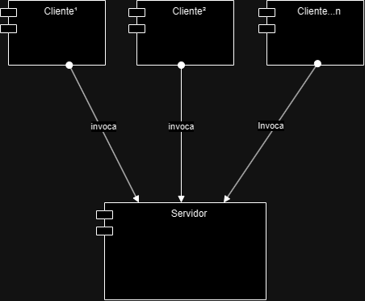

 
## Objetivo
Desenvolver um  live chat (chat em tempo real) usando java RMI (Remote Method Invocation)

## Descrição
O intuito é construir aplicações que usem de uma biblioteca do java chamada java rmi (java remote invocation method ), irei construir um chat em tempo real que deverá ser composto de 2 aplicações uma delas sendo o servidor e a outra sendo cliente que por sua vez pode ser instanciada N vezes, simulando pessoas diferentes conectando ao chat, o diferencial que eles estarão tendo acesso ao mesmo objeto do tipo Chat, o que faz a realização do trabalho ser um sucesso, e acarreta em possíveis problemas de concorrência para N clientes.

## Desenvolvimento




Nosso objetivo é transformar esse diagrama em código, mão na massa.

Usando a seguinte hierarquia de modulos:
Utilizando [Apache Maven](https://maven.apache.org) é possivel criar um projeto java composto por vários sub projetos (modules) e para esse projeto foi o que foi ultilizado.

```

    cliente:
	    src:
		    java.dev.rayh:
			    - Cliente.java -> main()
			    - domain:
				   - utils:
				    - ClientObserver.java
    core:
		src:
			java.dev.rayh:
				domain:
					- Server.java
					- Chat.java
					- Message.java
			utils:
				- Observer.java
				- RemoteObserver.java
	servidor:
		src:
			java.dev.rayh:
				- domain:
					- impl:
						- ServerImpl.java
				- Main.java -> main()
```
### Server.java
Devemos criar uma interface para poder definir o comportamento nas duass  aplicações (cliente e servidor) mesmo que a implementação será somente pelo lado do servidor, o cliente deve saber quais são os métodos enquanto que a referência remota de objeto retorna uma objeto do tipo Object.

Um ponto importante a ser levantado é que todo objeto que deve ser exposto para a referencia remota deve sempre extender de _java.rmi.Remote_ e seus metodos devem lançar uma exceção _java.rmi.RemoteException_ do demais a implementação é normal a de qualquer outra interface usando java.

```java
public interface Server extends Remote throws RemoteException {
  void join (RemoteObserver remoteObserver, Message message) throws RemoteException ;
  void sendMessage(Message, message) throws RemoteException;
}
```

Tendo a interface nos basta agora a implementação dela.
### ServerImpl.java
Será a implementação da nossa classe server isto é, todos os metodos descritos na interface Server deverá ser realmente implementados aqui tendo em mente possíveis excessões.

A implementação é como qualquer outra implementação de interfaces java, o que altera aqui é que ela deve extender de java.rmi.server.UnicastRemoteObject() e deve conter um construtor que inicialize o super() e lance uma RemoteException.

```java
@Data
public class ServerImpl extends UnicastRemoteOlbject implements Server throws RemoteException {

private Chat chat;

public ServerImpl(){
  super()
  chat = new Chat()
}

void join (RemoteObserver remoteObserver, Message message) throws RemoteException {
	//implementação
};
void sendMessage(Message, message) throws RemoteException {
	//implementação
};

```


### Chat.java
O intuito do chat é ser a classe principal do nosso aplicativo ele quem vai guardar as imagens e se necessário disparar um aviso para os demais clientes de atualizações em si mesmo.

```java
public class Chat {
	private List<Message> messages;
	private List<Observer> observers;
	
	public Chat(){
		messages = new LinkedList();
		observers = new Linkedlist();
	}
	
	public void addUser(RemoteObserver user, Message message){
		observers.add(user);
	}

	public void addMessage(Message message){
		messages.add(message);
		notifyAllUsers(message);
	}
	
	private void notifyAllUsers(Message message){
		for(RemoteObserver observer : observers){
			observer.update(message);
		}
	}

}

```
#### _importate_
O objeto RemoteObserver é uma interface criada, contudo ele também é um objeto remoto, o que faz que essa referência seja também seja um rmi (remote invocation method) contudo a própria biblioteca ajusta isso, pois quando houver a chamada do cliente para o servidor ele passará a referencia desses objetos instanciados ( RemoteObserver )

## Implementação da classe Main.java ( servidor )
Essa classe vai apenas subir um registry (stub) que vai guardar as referencias remotas quando objeto for exposto para invocações remotas.
Uma coisa importante é na criação registry  deve-se passar a porta que quer associar no contrutor ou passar _null_ para associar a porta padrão 1099

```java
Registry registry = LocateRegistry.createRegistry(8080);
// ou
Registry registry = LocateRegistry.createRegistry(null);
```

```java
  Server server = new ServerImpl();
  Naming.rebind("rmi://localhost:8080/server", server);
```

O código completo do servidor se resume a:

```java
public static void main(String[] args) {
        try {
			Server server = new ServerImpl();
            //criando um registry na porta especificada
            Registry registry = LocateRegistry.createRegistry(8080);
            //Associando o objeto a um nome no registry local
            Naming.rebind("rmi://localhost:8080/server", server);

        } catch (RemoteException e) {
            throw new RuntimeException(e);
        } catch (MalformedURLException e) {
            throw new RuntimeException(e);
        }
    }
```

## Programa Cliente

### - ClienteObserver.java
Esta classe é uma implementação da interface RemoteObserver que estende de java.rmi.Remote:

RemoteObserver.java
```java
public interface RemoteObserver extends java.rmi.Remote {
	void update(Message message) throws RemoteException;
}
```

ClienteObserver.java:
```java
@NoArgsConstructor
public class ClientObserver extends UnicastRemoteObject implements RemoteObserver {
	void update(Message message) throws RemoteException {
		//mostrar mensagem nova na tela
	}
}
```

Cliente.java
A idéia da classe cliete é simplesmente enviar mensagens e quando notificado mostrar a nova mensagem na tela usando o método do observer.

```java
  Server server = (Server) Naming.lookout("rmi://localhost:8080/server");
```

Tendo esse a referência do objeto: basta invocar o metodo para entrar no chat e começar a enviar mensagens.

```java
RemoteObserver observer = new ClientObserver();
Messagem msg = new Message();

server.join(observer, msg);
while( true ){
	server.sendMessage(new Message());
}

```

Implementação completa Cliente:

```java
public class Cliente {

	private static Observer observer = new ClientObserver();
	private final static Scanner scanner = new Scanner(System.in) ;
	
	public static void main(String[] args){
		try {
			Registry registry = LocateRegistry.getRegistry("localhost", 8081);
			Server server = (Server) Naming.lookup("rmi://localhost:8081/server");
			Message msg = new Message();
			
			//pedindo para o usuário inserir o nome dele
			System.out.println("insira o seu nome de usuário")
			msg.setUser(scanner.nextLine());
			
			server.join(observer, msg);
			
			//UX
			String resp = "";
			while ( true ){
				resp = scanner.nextLine();
				message.setText(resp);
				server.sendMessage(message);
			}
			
		}catch(RemoteException exception){
			throw new RuntimeException(exception);
		}
	}
}
```


